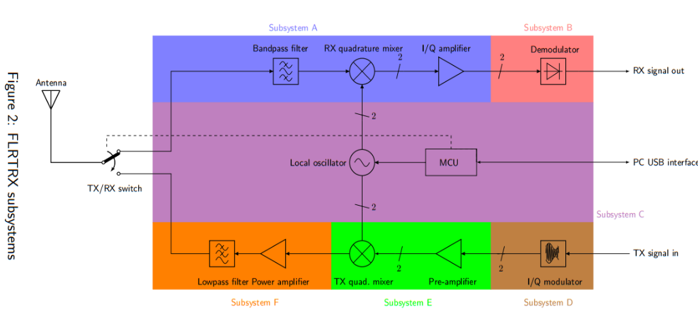
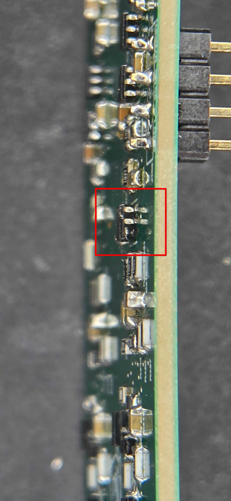

# Subsystem A
## Overview
My team was tasked with implementing Subsystem A as part of the ECE295 hardware design course. This subsystem consists of an RX Filter and Quadrature Mixer and is part of the receive chain of the Flexible Radio Transceiver (FLRTRX).

  

 

## Motivation

The LNA and mixer are discrete implementations using NPN BJTs because I thought it was more fun and interesting to do it this way. I am pleased with the results and I have become much more comfortable designing and working with transistors.

I was previously quick to rush to the PCB design stage, but now have a lot more appreciation for simulation using spice. I think it is much more important (maybe obviously) to get the functionality right before arranging and routing components, even if the second part can seem more fun and less frustrating.

I had a wonderful experience with the design aspect of the course and would highly recommend others to take a similar discrete design approach.

## Design

The design consists of five main stages that are described below in more detail.

[📄 View Schematic (PDF)](assets/pdf/Schematic.pdf)

### Band-pass Filter
* **Requirements**: 8 and 16 MHz cutoff frequencies; amplitude balance within 1dB.
* **Implementation**: 3rd-order passive Butterworth filter. 
* **Rationale**: A Butterworth response was chosen for its maximally flat passband to maintain amplitude balance across the 8-16 MHz window. A passive topology was used as the MHz-range bandwidth made active op-amp designs unfeasible.

### Low Noise Amplifier (LNA)
* **Requirements**: 50 $\Omega$ input impedance; Noise $< 3\text{nV}/\sqrt{\text{Hz}}$.
* **Implementation**: Cascode (common-emitter to common-base) amplifier.
* **Rationale**: Designed to compensate for band-pass filter insertion loss, mask noise contributions from subsequent stages, and present a 50 $\Omega$ match to the BPF to preserve the receiver signal integrity.

### Gilbert Cell Mixer
* **Requirements**: 90° (12.5° tolerance) phase difference between I/Q signals.
* **Implementation**: Active Gilbert Cell mixer.
* **Rationale**: An active topology avoids passive losses and provides superior local-oscillator-to-intermediate-frequency isolation for a cleaner output. 

### Low-pass Filter
* **Requirements**: 92 kHz cutoff frequency.
* **Implementation**: Second-order Sallen-Key active filter.
* **Rationale**: Yields a Butterworth response similar to the BPF but without passive insertion losses.

### Amplifier
* **Requirements**: $\ge 30\text{ dB}$ post-mixer gain.
* **Implementation**: Non-inverting amplifier.
* **Rationale**: Provides a dedicated stage for final gain control by swapping a single resistor while keeping previous stages isolated.

## PCB Assembly & Rework
The design was assembled using SMD components.

  

 

### Hardware Issues
During testing, it was discovered that the differential amplifier inverting and non-inverting pins were flipped during the PCB layout phase. 

*Note: this issue has already been fixed in design files in this repository.*

* **Fix**: The affected op-amp pins were lifted to prevent pad contact. 
* **Implementation**: Fine strands from a 22AWG wire were used to manually jump the pins to the correct resistor nodes.

 

  
  

 

## Testing & Results
Testing was conducted using lab equipment and automated Python scripts to produce Bode plots for each stage.

| Band-pass Filter | Amplitude Balance |
| :---: | :---: |
|  |  |
| *Frequency response across the target passband* | *Balance difference between I/Q signals* |

| Low-pass Filter | I/Q Phase Difference |
| :---: | :---: |
|  |  |
| *92 kHz cutoff frequency response* | *90° quadrature separation verification* |

| Total Subsystem Gain |
| :---: |
|  |
| *Total signal gain throughout all stages* |